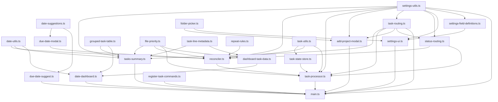

# Task Manager Plugin

Automates task lifecycle management in Obsidian: state transitions, completion metadata stamping, recurring task creation, file routing by status, editor autocomplete for date fields, a right-sidebar date dashboard, and generated task summary notes.

> For developer/agent architecture reference, see [`.github/copilot-instructions.md`](.github/copilot-instructions.md).

## Setup

1. Enable the **Task Manager** plugin in Obsidian settings.
2. Open **Plugin Settings** and configure:

   | Setting | Description | Default |
   |---|---|---|
   | Projects Folder | Root folder scanned for active project notes | — |
   | Completed Projects Folder | Destination for completed projects | — |
   | Waiting Projects Folder | Destination for waiting projects | — |
   | Someday-Maybe Projects Folder | Destination for someday-maybe projects | — |
   | Inbox File | File whose tasks appear in the dashboard Inbox section | — |
   | Tasks Summary File | File written by the Tasks Summary command | `Tasks Summary.md` |
   | Open Tasks Summary After Generation | Whether to open the summary note automatically after generation | Off |
   | Completed Status Field | Frontmatter field name written on completion | `status` |
   | Dashboard Filename Hide Keywords | Comma-separated keywords stripped from dashboard display names | — |

## Commands

### Reset Tasks
In the active file:
- Marks all tasks open (`[ ]`).
- Removes `[due:: ...]`, `[completion-date:: ...]`, `[completion-time:: ...]`, and `[created:: ...]` from task lines.
- Then re-runs the same task reconciliation and routing flow for the file.

### Tasks Summary
Creates or overwrites the configured **Tasks Summary File** with sections for **Projects**, **Waiting**, **Someday-Maybe**, and **Inbox**.

If the summary file already exists, the command overwrites it directly in place. It does not prompt to merge, append, or confirm replacement.
The summary note itself is excluded from automatic task routing and reconciliation.
The summary is also regenerated automatically whenever a project's file status changes.

By default, generating the summary does **not** open the summary note. Enable **Open Tasks Summary After Generation** in plugin settings if you want it opened automatically.

The summary note also stamps frontmatter metadata:
- `creation-date: YYYY-MM-DD`
- `creation-time: HH:MM:SS`

The **Projects** section is further split into:
- **Tasks Due This Week** — tasks with a due date on or before the end of the current week
- **Tasks Scheduled But Not Due This Week** — tasks with a due date after the end of the current week
- **Unscheduled Tasks** — tasks without a due date
- **Recurring Tasks** — tasks with `[repeat:: ...]` or `[repeats:: ...]`

Recurring tasks are shown **only** in the Recurring Tasks subsection, even if they also have a due date.

For each file, the summary includes the **first incomplete task** and renders a grouped table with:
- Folder
- Filename
- Task
- Priority
- Due (`MM-DD`)

Folder and filename display use the same hide-keyword cleanup as the date dashboard. Task text is rendered as **bold** for priority 1, *italic* for priority 2, and default styling for priority 3, using the file's frontmatter priority.

### Add New Project
Opens a modal to create a new project file. The form collects:

- **Name** — used for the filename and note heading
- **Folder** — target vault path, with folder suggestions as you type
- **Priority** — written to file frontmatter as `priority`
- **Status** — one of `todo`, `waiting`, or `someday-maybe`, written to the configured status frontmatter field
- **Tasks** — optional multiline text area; each non-empty line becomes an open task

The command creates the project note, creates missing parent folders, and opens the new file.

## Automatic Behavior (live editing)

The plugin reacts to checkbox changes as you edit:

### Task Completed (`[ ]` → `[x]`)
- Appends `[completion-date:: YYYY-MM-DD]` and `[completion-time:: HH:MM:SS]` to the completed task line.
- Moves the completed task line into the `## Completed Tasks` section of the same file (creates the section at the end if absent).
- The first remaining open task becomes the current actionable task implicitly. If none remain, the file status becomes `completed` and `completion-date` / `completion-time` are also stamped into the **file frontmatter**.
- Prompts with a **Due Date Modal** to assign a due date and set the file priority for the newly exposed first incomplete task (see below).

### Task Uncompleted (`[x]` → `[ ]`)
- If the reopened task is now the first open task, it becomes the current actionable task implicitly. Status resets to `todo`.

The plugin uses the first incomplete task in the file as the current actionable task.

### Recurring Tasks
If a completed task has `[repeat:: X]` or `[repeats:: X]`, a new open copy is inserted above the completed task with a computed due date:

| Interval | New due date |
|---|---|
| `day` | Tomorrow |
| `2 days` | +2 days |
| `week` | +7 days |
| `2 weeks` | +14 days |
| `month` | +1 month (clamped to last day of month) |
| `3 months` | +3 months (clamped to last day of month) |
| `year` | +1 year (clamped to last day of month) |
| `2 years` | +2 years (clamped to last day of month) |
| `Monday` | Next Monday |
| `Fri` | Next Friday |
| `1st` | Next occurrence of the 1st day of a month |
| `5th` | Next occurrence of the 5th day of a month |

Accepted aliases are normalized automatically:
- Day: `day`, `days`, `daily`
- Week: `week`, `weeks`, `weekly`
- Month: `month`, `months`, `monthly`
- Year: `year`, `years`, `yearly`
- Weekdays: full or short names like `monday` / `mon`
- Month days: ordinal forms `1st` through `31st`

Weekday and ordinal repeats always resolve to the **next future occurrence**. For example, `Monday` completed on a Monday becomes next Monday, and `5th` completed on the 5th becomes next month's 5th.

Recurring tasks skip the Due Date Modal on the new copy.

### Status Routing
When a file's status field changes to a routable value, the file is automatically moved to the matching destination folder.
That same status change also regenerates the Tasks Summary file silently in the background.

## Due Date Modal

When a different task becomes the file's first incomplete task after completion or uncompletion (and that task is not recurring and doesn't already have a due date), a modal appears offering:

- A preview of the task text.
- A **project priority** dropdown (1–3, default 3; 1 is highest).
- Suggested dates from today through +30 days with Today / Tomorrow / weekday labels — clicking one immediately applies it.
- A text input for a custom `YYYY-MM-DD` date or natural-language terms (`today`, `tomorrow`, weekday names); press Enter to submit.
- A **Skip** button to dismiss without adding a due date.

On submit, `[due:: YYYY-MM-DD]` is written to the task line and `priority: N` is written to the file frontmatter.

## Inline Field Format

Tasks use Dataview-style double-colon inline fields on the same line as the checkbox:

| Field | Description |
|---|---|
| `[due:: YYYY-MM-DD]` | Due date |
| `[completion-date:: YYYY-MM-DD]` | Stamped on task completion |
| `[completion-time:: HH:MM:SS]` | Stamped on task completion |
| `[repeat:: X]` / `[repeats:: X]` | Recurring interval; supports aliases, numeric intervals, weekday names like `Monday`, and ordinal month-days like `5th` |
| `[created:: YYYY-MM-DD]` | Creation date (editor suggest only) |

Project priority is stored in file frontmatter as `priority: N`, where `1` is highest and missing/invalid values default to `3`.

## Editor Autocomplete

- Typing `due::` opens a suggestion list from today through +30 days, labeled Today / Tomorrow / weekday names. Matches on ISO date or natural-language label. Inserts ` YYYY-MM-DD`.
- Typing `created::` suggests today's date. Inserts ` YYYY-MM-DD`.

## Date Dashboard

When the active note is named `YYYY-MM-DD`, a live dashboard opens in the right sidebar with three sections:

**Due** — open tasks with `[due:: YYYY-MM-DD]` where the due date is on or before the note date. Scanned from configured task-folder roots only. Rendered as two stacked tables: **Non-recurring Tasks** first, then **Recurring Tasks** below. Both use columns Folder | Filename | Task | Priority | Due (`MM-DD`) and are sorted by file priority, then due date.

**Inbox** — all open tasks from the configured Inbox File, regardless of date. Rendered as a heading, a file link, and an unordered list.

**Completed** — tasks with `[completion-date:: YYYY-MM-DD]` matching the note date. Columns: Folder | Filename | Task | Priority. Sorted by file priority, then file path.

Display notes:
- Due subtables and the Completed table are grouped by parent folder and filename using `rowspan`.
- Task text strips all inline fields and hashtag tags and is rendered as **bold** for priority 1, *italic* for priority 2, and default styling for priority 3, using the file's frontmatter priority.
- **Dashboard Filename Hide Keywords**: each keyword is removed case-insensitively from folder and filename display names.
- On non-date notes, the dashboard defaults to today's date.

## Code Organization

| File | Purpose |
|---|---|
| `main.ts` | Plugin entry point; wires all services and event listeners |
| `main.js` | Bundled runtime output loaded by Obsidian (`npm run build` regenerates this) |
| `src/tasks/task-processor.ts` | Central orchestrator: vault modify/create events, commands, routing |
| `src/tasks/reconciler.ts` | Task transition logic: completion, uncompletion, deletion, recurring |
| `src/tasks/file-priority.ts` | Pure helpers for reading file-frontmatter priority |
| `src/tasks/task-line-metadata.ts` | Pure shared task-line parsing and display-text helpers |
| `src/tasks/repeat-rules.ts` | Pure recurring-rule parser, alias normalizer, and next-due-date calculator |
| `src/tasks/task-utils.ts` | Pure parsing/diffing utilities (no side effects) |
| `src/tasks/task-state-store.ts` | In-memory per-file task/status snapshot cache and pending-write guards |
| `src/tasks/due-date-modal.ts` | Modal for collecting due date and file priority for the first incomplete task |
| `src/projects/add-project-modal.ts` | Modal and helpers for creating a new project note from command input |
| `src/tables/grouped-task-table.ts` | Pure grouped task-table model and shared display formatting for dashboard/summary tables |
| `src/summary/tasks-summary.ts` | Builds and writes the Tasks Summary note from configured sources |
| `src/routing/status-routing.ts` | Status extraction, validation, routable-status constants |
| `src/routing/task-routing.ts` | File movement: destination resolution, folder creation, merge handling |
| `src/dashboard/date-dashboard.ts` | Right-sidebar ItemView controller and renderer |
| `src/dashboard/dashboard-task-data.ts` | Task parsing/filtering/sorting for dashboard display |
| `src/date/date-utils.ts` | Pure shared date formatting and ISO date helpers |
| `src/editor/due-date-suggest.ts` | EditorSuggest providers for `due::` and `created::` inline fields |
| `src/date/date-suggestions.ts` | Canonical date suggestion list (ISO dates + human labels) |
| `src/settings/settings-utils.ts` | `TaskManagerSettings` type, `DEFAULT_SETTINGS`, `normalizeSettings()` |
| `src/settings/settings-ui.ts` | PluginSettingTab renderer |
| `src/settings/settings-field-definitions.ts` | Declarative metadata for settings controls |
| `src/settings/folder-picker.ts` | FuzzySuggestModal wrappers for vault folder/file pickers |
| `src/commands/register-task-commands.ts` | Registers Reset Tasks, Tasks Summary, and Add New Project commands |
| `manifest.json` | Obsidian plugin metadata |

## Dependency Graph

