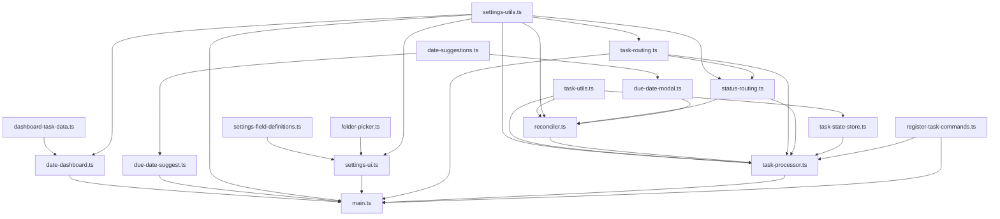

# Task Manager Plugin

Automates task lifecycle management in Obsidian: state transitions, completion metadata stamping, recurring task creation, file routing by status, editor autocomplete for date fields, and a right-sidebar date dashboard.

> For developer/agent architecture reference, see [`.github/copilot-instructions.md`](.github/copilot-instructions.md).

## Setup

1. Enable the **Task Manager** plugin in Obsidian settings.
2. Open **Plugin Settings** and configure:

   | Setting | Description | Default |
   |---|---|---|
   | Projects Folder | Root folder scanned for active project notes | — |
   | Completed Projects Folder | Destination for completed projects | — |
   | Waiting Projects Folder | Destination for waiting projects | — |
   | Someday-Maybe Projects Folder | Destination for someday-maybe projects | — |
   | Inbox File | File whose tasks appear in the dashboard Inbox section | — |
   | Next Action Tag | Tag marking the current actionable task | `#next-action` |
   | Completed Status Field | Frontmatter field name written on completion | `status` |
   | Dashboard Filename Hide Keywords | Comma-separated keywords stripped from dashboard display names | — |

## Commands

### Process Tasks
Applies `Process File` logic to every Markdown file under all four configured task-folder roots recursively.

### Process File
Processes the currently active file:
- Reconciles `#next-action` tag assignment across all tasks.
- Strips stale `[completion-date:: ...]` and `[completion-time:: ...]` from any open tasks.
- Routes the file by its frontmatter status:

  | Status | Destination |
  |---|---|
  | `todo` | Projects Folder |
  | `completed` | Completed Projects Folder |
  | `waiting` | Waiting Projects Folder |
  | `someday-maybe` | Someday-Maybe Projects Folder |

  - Relative sub-path from the matched source root is preserved at the destination.
  - Missing destination subfolders are created automatically.
  - If a destination file already exists, a prompt offers merge or skip.

### Reset Tasks
In the active file:
- Marks all tasks open (`[ ]`).
- Removes `[due:: ...]`, `[completion-date:: ...]`, `[completion-time:: ...]`, `[created:: ...]`, and `[priority:: ...]` from every task line.
- Then runs the same flow as **Process File**.

## Automatic Behavior (live editing)

The plugin reacts to checkbox changes as you edit:

### Task Completed (`[ ]` → `[x]`)
- Appends `[completion-date:: YYYY-MM-DD]` and `[completion-time:: HH:MM:SS]` to the completed task line.
- Moves the completed task line into the `## Completed Tasks` section of the same file (creates the section at the end if absent).
- Moves `#next-action` to the first remaining open task. If none remain, sets the file status to `completed` and stamps `completion-date` and `completion-time` into the **file frontmatter** as well.
- Prompts with a **Due Date Modal** to assign a due date and priority to the newly tagged task (see below).

### Task Uncompleted (`[x]` → `[ ]`)
- If the reopened task is now the first open task, retags it as `#next-action` and clears the tag from all others. Status resets to `todo`.

### Tagged Task Deleted
- Reassigns `#next-action` to the nearest preceding open task. If none, sets status to `completed`.

### Recurring Tasks
If a completed task has `[repeat:: every X]` or `[repeats:: every X]`, a new open copy is inserted above the completed task with a computed due date:

| Interval | New due date |
|---|---|
| `every day` | Tomorrow |
| `every week` | +7 days |
| `every month` | +1 month (clamped to last day of month) |
| `every year` | +1 year (clamped to last day of month) |

Recurring tasks skip the Due Date Modal on the new copy.

### Status Routing
When a file's status field changes to a routable value, the file is automatically moved to the matching destination folder.

## Due Date Modal

When `#next-action` is newly assigned to a task (and the task is not recurring and doesn't already have a due date), a modal appears offering:

- A preview of the task text.
- A **priority** dropdown (1–4, default 4; 1 is highest).
- Suggested dates from today through +30 days with Today / Tomorrow / weekday labels — clicking one immediately applies it.
- A text input for a custom `YYYY-MM-DD` date or natural-language terms (`today`, `tomorrow`, weekday names); press Enter to submit.
- A **Skip** button to dismiss without adding a due date.

On submit, `[due:: YYYY-MM-DD]` and `[priority:: N]` are written to the task line (updating existing values if present).

## Inline Field Format

Tasks use Dataview-style double-colon inline fields on the same line as the checkbox:

| Field | Description |
|---|---|
| `[due:: YYYY-MM-DD]` | Due date |
| `[completion-date:: YYYY-MM-DD]` | Stamped on task completion |
| `[completion-time:: HH:MM:SS]` | Stamped on task completion |
| `[repeat:: every X]` / `[repeats:: every X]` | Recurring interval |
| `[priority:: N]` | Priority 1–4 (1 = highest, default 4) |
| `[created:: YYYY-MM-DD]` | Creation date (editor suggest only) |

## Editor Autocomplete

- Typing `due::` opens a suggestion list from today through +30 days, labeled Today / Tomorrow / weekday names. Matches on ISO date or natural-language label. Inserts ` YYYY-MM-DD`.
- Typing `created::` suggests today's date. Inserts ` YYYY-MM-DD`.

## Date Dashboard

When the active note is named `YYYY-MM-DD`, a live dashboard opens in the right sidebar with three sections:

**Due** — open tasks with `[due:: YYYY-MM-DD]` where the due date is on or before the note date. Scanned from configured task-folder roots only. Columns: Folder | Filename | Task | Priority | Due (`MM-DD`). Sorted by priority, then due date.

**Inbox** — all open tasks from the configured Inbox File, regardless of date. Rendered as a heading, a file link, and an unordered list.

**Completed** — tasks with `[completion-date:: YYYY-MM-DD]` matching the note date. Columns: Folder | Filename | Task | Priority. Sorted by priority, then file path.

Display notes:
- Rows in Due and Completed tables are grouped by parent folder and filename using `rowspan`.
- Task text strips all inline fields and hashtag tags.
- **Dashboard Filename Hide Keywords**: each keyword is removed case-insensitively from folder and filename display names.
- On non-date notes, the dashboard defaults to today's date.

## Code Organization

| File | Purpose |
|---|---|
| `main.ts` | Plugin entry point; wires all services and event listeners |
| `main.js` | Bundled runtime output loaded by Obsidian (`npm run build` regenerates this) |
| `src/tasks/task-processor.ts` | Central orchestrator: vault modify/create events, commands, routing |
| `src/tasks/reconciler.ts` | Task transition logic: completion, uncompletion, deletion, recurring |
| `src/tasks/task-utils.ts` | Pure parsing/diffing utilities (no side effects) |
| `src/tasks/task-state-store.ts` | In-memory per-file task/status snapshot cache and pending-write guards |
| `src/tasks/due-date-modal.ts` | Modal for collecting due date and priority on next-action assignment |
| `src/routing/status-routing.ts` | Status extraction, validation, routable-status constants |
| `src/routing/task-routing.ts` | File movement: destination resolution, folder creation, merge handling |
| `src/dashboard/date-dashboard.ts` | Right-sidebar ItemView controller and renderer |
| `src/dashboard/dashboard-task-data.ts` | Task parsing/filtering/sorting for dashboard display |
| `src/editor/due-date-suggest.ts` | EditorSuggest providers for `due::` and `created::` inline fields |
| `src/date/date-suggestions.ts` | Canonical date suggestion list (ISO dates + human labels) |
| `src/settings/settings-utils.ts` | `TaskManagerSettings` type, `DEFAULT_SETTINGS`, `normalizeSettings()` |
| `src/settings/settings-ui.ts` | PluginSettingTab renderer |
| `src/settings/settings-field-definitions.ts` | Declarative metadata for settings controls |
| `src/settings/folder-picker.ts` | FuzzySuggestModal wrappers for vault folder/file pickers |
| `src/commands/register-task-commands.ts` | Registers Process Tasks, Process File, and Reset Tasks commands |
| `manifest.json` | Obsidian plugin metadata |

## Dependency Graph

