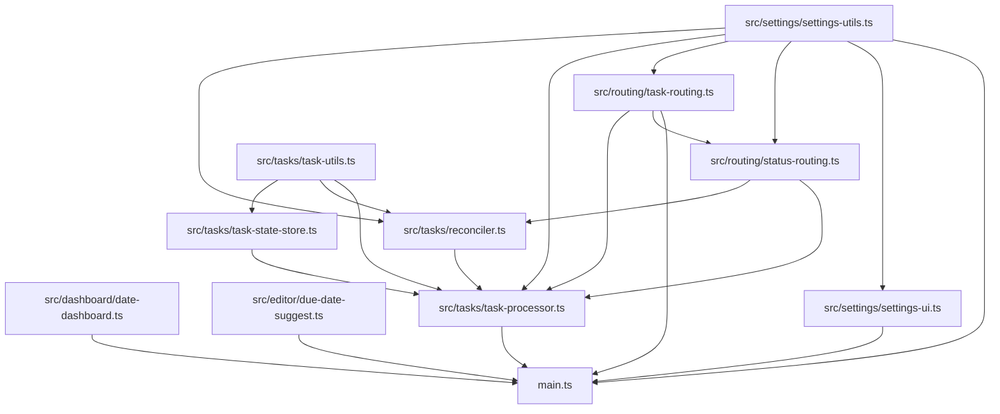

# Task Manager Plugin

## For Agents

For a detailed architecture and behavior handoff, see [AGENT_STARTUP_SUMMARY.md](AGENT_STARTUP_SUMMARY.md).

## How To Use

1. Open Obsidian and enable the `Task Manager` plugin.
2. Open plugin settings and configure:
   - `Projects Folder`: root folder to scan for project notes.
   - `Completed Projects Folder`: destination folder for completed projects.
   - `Waiting Projects Folder`: destination folder for waiting projects.
   - `Scheduled Projects Folder`: destination folder for scheduled projects.
   - `Someday-Maybe Projects Folder`: destination folder for someday-maybe projects.
   - `Next Action Tag`: tag applied to the current actionable task (default `#next-action`).
   - `Completed Status Field`: frontmatter field name to update (default `status`).
3. Run the `Process Tasks` command from the Command Palette:
   - Applies `Process File` behavior to all Markdown files under any configured task folder recursively.
4. Run `Process File` to process only the active note:
   - Reconciles next-action tags in the file.
   - If the file still has open tasks and current status is not `completed`, status is preserved.
   - Routes the file by status:
      - `todo` -> `Projects Folder`
      - `completed` -> `Completed Projects Folder`
      - `waiting` -> `Waiting Projects Folder`
      - `scheduled` -> `Scheduled Projects Folder`
      - `someday-maybe` -> `Someday-Maybe Projects Folder`
   - Preserves relative hierarchy from `Projects Folder` inside destination roots.
   - Creates missing destination subfolders as needed.
   - If destination file exists, prompts to merge or do nothing.
   - If a required destination folder is not configured, throws an error and does nothing.
5. During normal editing, the plugin reacts to task changes automatically:
   - **Task completed** (`[ ]` → `[x]`): stamps completion metadata on the completed task and moves the next-action tag to the first incomplete task anywhere in the file; if none remain, sets status to `completed`.
   - **Recurring tasks**: if a completed task contains `[repeat:: ...]` or `[repeats:: ...]`, the plugin creates a new open copy above the completed task with a computed due date:
      - `every day` → due date of tomorrow
      - `every week` → due date one week from today
      - `every month` → due date one month from today (clamped to closest valid date)
      - `every year` → due date one year from today (clamped to closest valid date)
   - **Task uncompleted**: if the reopened task is now the first open task in the file, strips the tag from all other tasks and applies it to this one; status is reset to `todo`.
   - **Tagged task deleted**: moves the next-action tag to the nearest preceding incomplete task; if none, sets status to `completed`.
   - **Status changed**: when a file's status changes to one of the routable statuses, the file is moved automatically to the matching destination folder.
6. While typing in a Markdown editor, entering `due::` opens a date suggestion list:
   - Suggestions start at today and continue forward for 30 days.
   - Inserted date format is `YYYY-MM-DD`.
   - Typing a partial date filters suggestions by prefix.
7. If the open note is named like `YYYY-MM-DD`, the plugin shows a live dashboard in the right sidebar with two tables:
   - The dashboard opens in a split right-sidebar leaf by default (typically the bottom half when a split is available).
   - Due: open tasks with `[due:: YYYY-MM-DD]` on or before the note date, with a `MM-DD` due-date column
   - Completed: tasks with `[completion-date:: YYYY-MM-DD]` exactly matching the note date
   - Each table includes clickable filenames and cleaned task text:
      - filename display removes `.md` and leading numeric archival prefixes
      - task display removes inline fields and hashtag tags (for example `#next-action`)
   - The dashboard only scans Markdown files inside the configured task folders.

### Completion Metadata

When a task becomes completed, the plugin appends:

- `[completion-date:: YYYY-MM-DD]`
- `[completion-time:: HH:MM:SS]`

Recurring task copies use due dates in this format:

- `[due:: YYYY-MM-DD]`

## Code Organization

- `main.ts`: TypeScript source entrypoint (source of truth).
- `main.js`: bundled runtime output loaded by Obsidian (`npm run build` regenerates this file).
- `src/dashboard/date-dashboard.ts`: right-sidebar date dashboard view, data collection, and rendering.
- `src/editor/due-date-suggest.ts`: editor autocomplete provider for `due::` date suggestions.
- `src/tasks/task-processor.ts`: task reconciliation, modify handling, status tracking, and file routing orchestration.
- `src/tasks/task-state-store.ts`: in-memory per-file task/status state and pending write guards.
- `src/tasks/task-utils.ts`: task parsing, state diffing, and tag manipulation utilities.
- `src/tasks/reconciler.ts`: completion, uncompletion, deletion, and initialization reconciliation workflows.
- `src/routing/status-routing.ts`: status parsing, predicted status logic, and routing validation helpers.
- `src/routing/task-routing.ts`: file routing, folder path helpers, and merge prompt.
- `src/settings/settings-utils.ts`: settings type, defaults, and normalization helpers.
- `src/settings/settings-ui.ts`: settings tab rendering and folder picker UI.
- `manifest.json`: Obsidian plugin metadata.
- Obsidian typings are provided by the `obsidian` npm package in `devDependencies`.

## Dependency Graph

