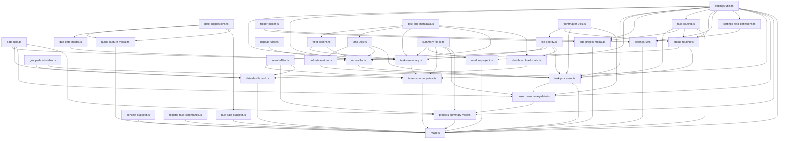

# Task Manager Plugin

Automates task lifecycle management in Obsidian: state transitions, completion metadata stamping, recurring task creation, file routing by status, editor autocomplete for date fields, a right-sidebar date dashboard, and live, searchable Tasks Summary and Projects Summary tabs.

> For developer/agent architecture reference, see [`CLAUDE.md`](CLAUDE.md).

## Setup

1. Enable the **Task Manager** plugin in Obsidian settings.
2. Open **Plugin Settings** and configure:

   | Setting | Description | Default |
   |---|---|---|
   | Projects Folder | Root folder scanned for active project notes | — |
   | Completed Projects Folder | Destination for completed projects | — |
   | Waiting Projects Folder | Destination for waiting projects | — |
   | Someday-Maybe Projects Folder | Destination for someday-maybe projects | — |
   | Scheduled Projects Folder | Destination for scheduled (tickler) projects — deferred via the due date on the first task, hidden from the dashboard/Tasks Summary until then | — |
   | Inbox File | File whose tasks appear in the dashboard Inbox section and the Tasks Summary tab | — |
   | Completed Status Field | Frontmatter field name written on completion | `status` |
   | Dashboard Filename Hide Keywords | Comma-separated keywords stripped from display names in the dashboard and Tasks Summary tab | — |
   | Known Contexts | Comma-separated task contexts (e.g. `@home, @calls, @errands`) powering the Context filter dropdown (in the dashboard and Tasks Summary tab) and `context::` editor autocomplete | — |
   | Enable Multiple Next Actions | Let a project surface one actionable task per context, instead of only ever the file's first open task | Off |
   | Someday-Maybe Review Cadence (days) | Days a Someday-Maybe project can go unreviewed before the Projects Summary flags it | `30` |
   | Waiting Staleness Threshold (days) | Days a project can stay in Waiting before the Projects Summary flags it as stale | `7` |

## Commands

### Reset Tasks
In the active file:
- Marks all tasks open (`[ ]`).
- Removes `[due:: ...]`, `[completion-date:: ...]`, `[completion-time:: ...]`, and `[created:: ...]` from task lines.
- Then re-runs the same task reconciliation and routing flow for the file.

### Open Tasks Summary
Opens a **Tasks Summary** tab (a full main-panel tab, not a generated note or sidebar panel — same placement pattern as Projects Summary), reusing an already-open tab instead of duplicating it. It renders task tables for **Projects**, **Waiting**, **Someday-Maybe**, and **Inbox**, live from the vault — there is nothing to generate, overwrite, or keep in sync. The Scheduled folder is deliberately excluded — see [Scheduled Projects](#scheduled-projects).

While a Tasks Summary tab is open, it auto-refreshes (debounced) whenever a relevant project file is modified, renamed, or deleted elsewhere — including project status changes and Due Date Modal submits. There's no separate "regenerate" step.

For each file, the summary includes the **first incomplete task** (or, with **Enable Multiple Next Actions** on, one row per actionable task — see [Multiple Next Actions](#multiple-next-actions)) — every open task regardless of due date, unlike the dashboard's Due section which only shows tasks due on the active date. Each section renders a grouped table with:
- Folder
- Project
- Task
- Priority
- Recurrence
- Context
- Due (`MM-DD`)

Rows are ordered with priority 1 first, then due date, then file path. Folder and filename display use the same hide-keyword cleanup as the date dashboard. The recurrence column shows the repeat value or `none` for non-recurring tasks. The **Project** cell's link is rendered as **bold** for priority 1, *italic* for priority 2, and default styling for priority 3, using the file's frontmatter priority — priority is a project property, so the decoration is on the project name, not the task text; this is the same styling used in the date dashboard and Projects Summary.

**Context filter**: when **Known Contexts** is configured, a dropdown appears above the sections, identical in behavior to the date dashboard's — selecting a context narrows every section to matching rows. The selection is per-session UI state, not saved to settings.

**Search**: a search box above the sections narrows every row to those matching the typed text (task text, file path, or context — case-insensitive).

### Add New Project
Opens a modal to create a new project file. The form collects:

- **Name** — used for the filename and note heading
- **Folder** — target vault path, with folder suggestions as you type
- **Priority** — written to file frontmatter as `priority`
- **Status** — one of `todo`, `waiting`, `someday-maybe`, or `scheduled`, written to the configured status frontmatter field
- **Scheduled Date** — shown only when Status is `scheduled`; a required `YYYY-MM-DD` date, written as the due date on the first starter task below it (see [Scheduled Projects](#scheduled-projects)) — requires at least one starter task
- **Tasks** — optional multiline text area; each non-empty line becomes an open task

The command creates the project note, creates missing parent folders, and opens the new file.

### Open Random Someday-Maybe Project
Opens a random project file from the configured **Someday-Maybe Projects Folder** in a new tab, stamping `reviewed: YYYY-MM-DD` on it first (see [Open Projects Summary](#open-projects-summary)) — a casual glance still counts as a review. Also available as a shuffle-icon ribbon button in the left sidebar. If the folder setting is empty, or the folder contains no project files, a notice explains why nothing opened instead of failing silently.

### Quick Capture Task
Opens a single-line capture modal from anywhere in the vault — no need to open the Inbox File first. Also available as a list-plus-icon ribbon button in the left sidebar. Press Enter or click **Capture** to insert the text as a new open task (`- [ ] ...`) at the top of the configured **Inbox File** (right after the frontmatter block, if any), creating that file first if it doesn't exist yet.

End the input with `due:` followed by a date to attach a due date at capture time, e.g. `Call the dentist due:tomorrow` or `Renew passport due:2026-08-01` — accepts the same values as the `due::` editor autocomplete (ISO dates, `today`/`tomorrow`, weekday names). Also end the input with one or more `@context` tags, in any order relative to `due:`, e.g. `Call the dentist due:tomorrow @calls` or `Water the plants @home`. Recognized trailing tokens are stripped from the task text and written as `[due:: ...]` / `[context:: ...]` inline fields; an unrecognized trailing `due:` token is left in place as part of the task text instead of being dropped. If the Inbox File setting is empty, a notice explains why the modal didn't open.

### Open Projects Summary
Opens a **Projects Summary** tab (a full main-panel tab, not a generated note or sidebar panel) with four sections. Every section's **Project** column links to the file styled by the file's frontmatter priority — **bold** for priority 1, *italic* for priority 2, default for priority 3, same convention as the date dashboard and Tasks Summary — and each table also has a plain numeric **Priority** column:

- **Active Projects** — every project in the configured **Projects Folder**, with Priority, Days Since Review, and Last Reviewed columns, sorted least-recently-reviewed first — no filtering or threshold, the full list is always shown. Never-reviewed projects sort first. Each row has a **Mark Reviewed** button that stamps today's date; the project then sorts toward the bottom of the list on the next refresh, since the list is always ordered stalest-first.
- **Waiting** — every project in the configured **Waiting Projects Folder**, with Priority, Days Waiting, and Waiting Since columns, sorted most-stale-first. Projects with no `waiting-since` stamp yet (e.g. from before this feature existed) sort first; run **Stamp Waiting-Since For Existing Waiting Projects** (below) to backfill them. A project is marked **Newly stale** when it crosses the **Waiting Staleness Threshold** setting within the current week (Monday through Sunday).
- **Someday-Maybe** — every project in the configured **Someday-Maybe Projects Folder**, with Priority, Days Since Review, and Last Reviewed columns, sorted most-overdue-first. Never-reviewed projects sort first. A project is marked **Needs Review** when it's never been reviewed or has gone longer than the **Someday-Maybe Review Cadence** setting. Each row has a **Mark Reviewed** button that stamps today's date and refreshes the table in place.
- **Scheduled** — every project in the configured **Scheduled Projects Folder**, with Priority, Scheduled Date, and Days Until columns (the date is read from the due date on the file's first task), sorted soonest-to-arrive first. Projects whose first task has no due date sort last (there's no date to act on, unlike the other sections' never-stamped-sorts-first convention). Each row has a **Promote Now** button to pull a project out of Scheduled ahead of its date. See [Scheduled Projects](#scheduled-projects).

`waiting-since` is stamped automatically the moment a project's status changes to `waiting`, and cleared when it leaves `waiting` — no manual action needed for projects routed after this feature shipped. `reviewed` (shared by Active Projects and Someday-Maybe) is stamped by clicking **Mark Reviewed** in this view, or — for Someday-Maybe only — by opening a project via **Open Random Someday-Maybe Project**, which doubles as a casual review at no extra effort.

While a Projects Summary tab is open, it auto-refreshes (debounced) whenever a file in the Projects, Waiting, Someday-Maybe, or Scheduled folders is modified, renamed, or deleted elsewhere — you don't need to close and reopen the tab, or re-run the command, to see changes made from another note.

**Search**: a search box above the sections narrows every row to files whose name or path matches the typed text (case-insensitive).

### Stamp Waiting-Since For Existing Waiting Projects
A one-time backfill command: stamps today's date on any file in the Waiting Projects Folder that doesn't already have a `waiting-since` field (from before the Projects Summary feature existed). Safe to re-run — files that already have the field are skipped.

## Automatic Behavior (live editing)

The plugin reacts to checkbox changes as you edit, but only for markdown files inside the configured Projects / Completed / Waiting / Someday-Maybe / Scheduled folders and the configured Inbox File. Random notes elsewhere in the vault are ignored by the live task-processing pipeline.

### Task Completed (`[ ]` → `[x]`)
- Appends `[completion-date:: YYYY-MM-DD]` and `[completion-time:: HH:MM:SS]` to the completed task line.
- Moves the completed task line into the `## Completed Tasks` section of the same file (creates the section at the end if absent), along with any attached note lines (see [Task Notes](#task-notes)).
- The first remaining open task becomes the current actionable task implicitly. If none remain, the file status becomes `completed` and `completion-date` / `completion-time` are also stamped into the **file frontmatter** — except for the configured Inbox File, which is never stamped `completed` even when it has zero open tasks, since it's a perpetual landing zone, not a project. Its status stays `todo`.
- Prompts with a **Due Date Modal** to assign a due date and set the file priority for the newly exposed actionable task (see below).

### Task Uncompleted (`[x]` → `[ ]`)
- If the reopened task is now actionable (see below), it becomes the current actionable task implicitly. Status resets to `todo`.

By default, the plugin uses the first incomplete task in the file as the current actionable task. See **Multiple Next Actions** below for the optional per-context variant.

### Multiple Next Actions
Enable **Enable Multiple Next Actions** in plugin settings to let a project surface more than one actionable task at once — one per distinct `[context:: ...]` value among its open tasks, in addition to the file's first open task. This affects:
- Which task(s) trigger the Due Date Modal on completion/uncompletion
- Which task(s) appear as rows in the **Tasks Summary** table (one row per actionable task instead of one row per file)

With the setting off (the default), behavior is unchanged: exactly one actionable task per file, same as before contexts existed. With it on, completing a task only pops the Due Date Modal if that completion actually promotes a *new* actionable task (e.g. finishing the file's only `@home` task exposes the next `@home` task); if more than one task becomes newly actionable at once, the modal opens for the first one only.

### Recurring Tasks
If a completed task has `[repeat:: X]` or `[repeats:: X]`, a new open copy is inserted above the completed task with a computed due date:

| Interval | New due date |
|---|---|
| `day` | Tomorrow |
| `2 days` | +2 days |
| `week` | +7 days |
| `2 weeks` | +14 days |
| `month` | +1 month (clamped to last day of month) |
| `3 months` | +3 months (clamped to last day of month) |
| `year` | +1 year (clamped to last day of month) |
| `2 years` | +2 years (clamped to last day of month) |
| `Monday` | Next Monday |
| `Fri` | Next Friday |
| `1st` | Next occurrence of the 1st day of a month |
| `5th` | Next occurrence of the 5th day of a month |

Accepted aliases are normalized automatically:
- Day: `day`, `days`, `daily`
- Week: `week`, `weeks`, `weekly`
- Month: `month`, `months`, `monthly`
- Year: `year`, `years`, `yearly`, `annual`, `annually`
- Weekdays: full or short names like `monday` / `mon`
- Month days: ordinal forms `1st` through `31st`

Weekday and ordinal repeats always resolve to the **next future occurrence**. For example, `Monday` completed on a Monday becomes next Monday, and `5th` completed on the 5th becomes next month's 5th.

Recurring tasks skip the Due Date Modal on the new copy.

### Status Routing
When a file's status field changes to a routable value, the file is automatically moved to the matching destination folder.
The configured Inbox File is never moved by status routing, even if all of its tasks are completed. It's also exempt from completion-stamping itself — see above.
When the plugin edits a project file's frontmatter metadata during this flow, it also writes `priority: 3` if the file does not already have a priority field.
When a file's status changes to `waiting`, `waiting-since: YYYY-MM-DD` is also stamped into its frontmatter (today's date); when it changes away from `waiting`, that field is removed. This powers the Projects Summary's staleness tracking — see [Open Projects Summary](#open-projects-summary).
That same status change also refreshes any open Tasks Summary tab, since a status change moves the file.

## Scheduled Projects

The `scheduled` status is for projects that don't need review or action right now but should reappear on a specific future date — a GTD-style "tickler." A scheduled project:

- Lives in the configured **Scheduled Projects Folder**, routed there like any other status.
- Has **no separate scheduling field** — its date comes from the `[due:: YYYY-MM-DD]` on its **first task** (whichever task is currently first/actionable in the file). There's nothing extra to keep in sync: set or change the due date on that task the same way you would for any other task, and the project's schedule follows.
- Is **excluded** from the date dashboard's Due/Completed sections and from the Tasks Summary tab, so it never demands attention before its date. It still appears in the **Projects Summary**'s Scheduled section for a lightweight glance (see [Open Projects Summary](#open-projects-summary)), and its checkboxes still reconcile normally if you edit it directly.
- **Auto-promotes to `todo`** once today is within **7 days** of that first task's due date — not on the date itself, so it surfaces in your Projects folder with a week of lead time instead of risking getting missed — routing the file to the Projects Folder like any other status change. The due date on the task is left untouched; it just becomes an ordinary task due date once the project is `todo`. This is checked in two places: once at plugin load (so items don't sit un-promoted just because Obsidian was closed when the lead window opened), and again on any edit to the file. You can also jump the queue early with **Promote Now** in the Projects Summary's Scheduled section. A project with no due date on its first task is never auto-promoted — it just sits in Scheduled like a Someday-Maybe item until you add one or promote it manually.

**Add New Project** offers a convenience **Scheduled Date** field when Status is `scheduled` (required, at least one starter task required too) — it's written as the `[due:: YYYY-MM-DD]` on the first starter task, not to frontmatter.

## Due Date Modal

When a task newly becomes actionable after completion or uncompletion (and that task is not recurring), a modal appears offering:

- A preview of the task text.
- A **project priority** dropdown (1–3, default 3; 1 is highest).
- Suggested dates from today through +30 days with Today / Tomorrow / weekday labels — clicking one immediately applies it.
- A text input for a custom `YYYY-MM-DD` date or natural-language terms (`today`, `tomorrow`, weekday names); press Enter to submit. If the task already has a due date, it is prefilled here.
- A **Repeat** text field with no default value for rules like `daily`, `2 weeks`, `Monday`, or `5th`.
- A **Skip** button to dismiss without adding a due date.

On submit, `[due:: YYYY-MM-DD]` is written to the task line, an optional `[repeat:: X]` is added when provided, and `priority: N` is written to the file frontmatter.
That update also refreshes any open Tasks Summary tab.

## Inline Field Format

Tasks use Dataview-style double-colon inline fields on the same line as the checkbox:

| Field | Description |
|---|---|
| `[due:: YYYY-MM-DD]` | Due date |
| `[completion-date:: YYYY-MM-DD]` | Stamped on task completion |
| `[completion-time:: HH:MM:SS]` | Stamped on task completion |
| `[repeat:: X]` / `[repeats:: X]` | Recurring interval; supports aliases, numeric intervals, weekday names like `Monday`, and ordinal month-days like `5th` |
| `[created:: YYYY-MM-DD]` | Creation date (editor suggest only) |
| `[context:: @home]` / `[contexts:: @home, @calls]` | One or more task contexts, comma-separated. The `@` prefix is added automatically if omitted |

Project priority is stored in file frontmatter as `priority: N`, where `1` is highest and missing/invalid values default to `3`.

## Task Notes

Plain indented lines written directly under a task (no checkbox) are treated as that task's note/description block — free text for context or detail that isn't independently actionable. A note block is any run of lines immediately below the task line that's indented deeper than the task itself and isn't a checkbox line or a heading; blank lines are allowed within the block for multi-paragraph notes.

```markdown
- [ ] Call the plumber [due:: 2026-07-20]
  Ask about the quote from last time — mentioned $200 for the fitting.
  Number is on the fridge whiteboard.
```

Note blocks are not tasks: they never appear as rows in the date dashboard, Tasks Summary, or Projects Summary, and they don't affect first-incomplete-task selection. When the task above them is completed, the note block moves into `## Completed Tasks` together with the completed line, directly beneath it — unless the task recurs (`[repeat:: ...]`), in which case the note block moves onto the newly inserted open clone instead, so multi-line context (a checklist, reference info) carries forward into the next occurrence rather than getting buried in completed-task history.

An indented **checkbox** line (`  - [ ]`) under a task is not a note — it's parsed and treated as its own independent task line, same as any top-level task (this plugin has no separate sub-task/child-task concept).

## Editor Autocomplete

- Typing `due::` opens a suggestion list from today through +30 days, labeled Today / Tomorrow / weekday names. Matches on ISO date or natural-language label. Inserts ` YYYY-MM-DD`.
- Typing `created::` suggests today's date. Inserts ` YYYY-MM-DD`.
- Typing `context::` or `contexts::` suggests from the configured **Known Contexts** setting, filtered as you type. Inserts ` @context`.

## Date Dashboard

When the active note is named `YYYY-MM-DD`, a live dashboard opens in the right sidebar with four sections:

**Due** — open tasks with `[due:: YYYY-MM-DD]` where the due date is on or before the note date. Scanned from the configured Projects / Completed / Waiting / Someday-Maybe folders and the configured Inbox File — deliberately **not** the Scheduled folder, whose projects stay hidden until their first task's due date arrives (see [Scheduled Projects](#scheduled-projects)). Rendered as a single table with columns Folder | Project | Task | Priority | Recurrence | Context | Due (`MM-DD`) and sorted by file priority, then due date.

**Current Page** — all open tasks written directly on the active date note itself. Rendered as an unordered list so tasks on the current page appear in the dashboard even when that note is outside the configured task folders.

**Inbox** — all open tasks from the configured Inbox File, regardless of date. Rendered as a heading, a file link, and an unordered list.

**Completed** — tasks with `[completion-date:: YYYY-MM-DD]` matching the note date from the same folders as Due above (Scheduled excluded). Columns: Folder | Project | Task | Priority | Recurrence | Context. Sorted by file priority, then file path.

Display notes:
- Due and Completed tables are grouped by parent folder and filename using `rowspan`, preserving priority-first row ordering.
- Task text strips all inline fields and hashtag tags. The **Project** cell's link, not the task text, carries the priority styling: **bold** for priority 1, *italic* for priority 2, default for priority 3, using the file's frontmatter priority.
- **Dashboard Filename Hide Keywords**: each keyword is removed case-insensitively from folder and filename display names.
- On non-date notes, the dashboard defaults to today's date.
- **Context filter**: when **Known Contexts** is configured, a dropdown appears above the sections. Selecting a context narrows Due, Current Page, Inbox, and Completed to tasks tagged with that context (via `[context:: ...]`); Current Page and Inbox list items also show their contexts in parentheses after the task text. The filter selection is per-session UI state, not saved to settings.
- **Search**: a search box above the sections narrows Due, Current Page, Inbox, and Completed to tasks matching the typed text (task text or context — case-insensitive).

## Code Organization

| File | Purpose |
|---|---|
| `main.ts` | Plugin entry point; wires all services and event listeners |
| `main.js` | Bundled runtime output loaded by Obsidian (`npm run build` regenerates this) |
| `src/tasks/task-processor.ts` | Central orchestrator: vault modify/create events, commands, routing |
| `src/tasks/reconciler.ts` | Task transition logic: completion, uncompletion, deletion, recurring |
| `src/tasks/file-priority.ts` | Pure helpers for reading file-frontmatter priority |
| `src/tasks/task-line-metadata.ts` | Pure shared task-line parsing and display-text helpers |
| `src/tasks/repeat-rules.ts` | Pure recurring-rule parser, alias normalizer, and next-due-date calculator |
| `src/tasks/task-utils.ts` | Pure parsing/diffing utilities (no side effects) |
| `src/tasks/next-actions.ts` | Pure actionable-task-line finder; single first-open-task by default, or one per context when Enable Multiple Next Actions is on |
| `src/tasks/task-state-store.ts` | In-memory per-file task/status snapshot cache and pending-write guards |
| `src/tasks/due-date-modal.ts` | Modal for collecting due date and file priority for a newly actionable task |
| `src/tasks/quick-capture-modal.ts` | Single-input modal for capturing a task into the Inbox File, with `due:` shorthand parsing |
| `src/tasks/frontmatter-utils.ts` | Shared single-field frontmatter parser over a content string |
| `src/projects/add-project-modal.ts` | Modal and helpers for creating a new project note from command input |
| `src/projects/random-project.ts` | Lists Someday-Maybe project files and picks one at random |
| `src/tables/grouped-task-table.ts` | Pure grouped task-table model and shared display formatting for dashboard/summary tables |
| `src/summary/tasks-summary.ts` | Pure(ish) data layer: collects actionable-task rows for the Tasks Summary tab from configured sources (no writes) |
| `src/summary/tasks-summary-view.ts` | On-demand main-panel ItemView controller/renderer for the Tasks Summary tab, with a live Context filter dropdown and auto-refresh on relevant vault changes |
| `src/summary/summary-file-io.ts` | Shared pure folder-scan/excluded-file helpers used by the Tasks Summary tab, Projects Summary, and the random-project picker |
| `src/routing/status-routing.ts` | Status extraction, validation, routable-status constants |
| `src/routing/task-routing.ts` | File movement: destination resolution, folder creation, merge handling |
| `src/dashboard/date-dashboard.ts` | Right-sidebar ItemView controller and renderer |
| `src/dashboard/dashboard-task-data.ts` | Task parsing/filtering/sorting for dashboard display |
| `src/date/date-utils.ts` | Pure shared date formatting, ISO date helpers, and end-of-week/threshold-crossing helpers used by the Projects Summary |
| `src/editor/due-date-suggest.ts` | EditorSuggest providers for `due::` and `created::` inline fields |
| `src/editor/context-suggest.ts` | EditorSuggest for `context::`/`contexts::`, sourced from the Known Contexts setting |
| `src/date/date-suggestions.ts` | Canonical date suggestion list (ISO dates + human labels) |
| `src/settings/settings-utils.ts` | `TaskManagerSettings` type, `DEFAULT_SETTINGS`, `normalizeSettings()` |
| `src/settings/settings-ui.ts` | PluginSettingTab renderer |
| `src/settings/settings-field-definitions.ts` | Declarative metadata for settings controls |
| `src/settings/folder-picker.ts` | FuzzySuggestModal wrappers for vault folder/file pickers |
| `src/commands/register-task-commands.ts` | Registers Reset Tasks, Open Tasks Summary, Add New Project, Open Random Someday-Maybe Project, Quick Capture Task, Open Projects Summary, and Stamp Waiting-Since commands |
| `src/review/projects-summary-view.ts` | On-demand main-panel ItemView controller/renderer for the Projects Summary tab, with auto-refresh on relevant vault changes |
| `src/review/projects-summary-data.ts` | Collects Active Projects/Waiting/Someday-Maybe staleness rows and stamps the `reviewed` field |
| `src/ui/search-filter.ts` | Shared search-box UI, used by the date dashboard, Projects Summary, and Tasks Summary views |
| `manifest.json` | Obsidian plugin metadata |

## Dependency Graph


```mermaid
graph TD
   M[main.ts]

   D[date-dashboard.ts]
   DTD[dashboard-task-data.ts]
   E[due-date-suggest.ts]
   CS[context-suggest.ts]
   DU[date-utils.ts]
   DS[date-suggestions.ts]

   SUI[settings-ui.ts]
   SU[settings-utils.ts]
   SFD[settings-field-definitions.ts]
   FP[folder-picker.ts]

   RS[status-routing.ts]
   RT[task-routing.ts]
   AP[add-project-modal.ts]
   RP[random-project.ts]
   GT[grouped-task-table.ts]

   TP[task-processor.ts]
   RC[reconciler.ts]
   PRI[file-priority.ts]
   TLM[task-line-metadata.ts]
   FMU[frontmatter-utils.ts]
   RR[repeat-rules.ts]
   DDM[due-date-modal.ts]
   QC[quick-capture-modal.ts]
   TS[task-state-store.ts]
   TU[task-utils.ts]
   NA[next-actions.ts]
   SUM[tasks-summary.ts]
   SUMV[tasks-summary-view.ts]
   SFIO[summary-file-io.ts]
   CMD[register-task-commands.ts]
   WRV[projects-summary-view.ts]
   WRD[projects-summary-data.ts]
   SF[search-filter.ts]

    D --> M
    E --> M
    CS --> M
    SU --> M
    SUI --> M
    RT --> M
    AP --> M
    TP --> M
    SUMV --> M
    CMD --> M
    QC --> M
    DS --> QC
    WRV --> M

    SF --> D
    SF --> WRV
    SF --> SUMV

    WRD --> WRV
    DU --> WRV
    SU --> WRV
    SFIO --> WRV
    SFIO --> WRD
    FMU --> WRD
    DU --> WRD
    TP --> WRD
    SU --> WRD

    SUM --> SUMV
    GT --> SUMV
    SU --> SUMV
    SFIO --> SUMV

     DTD --> D
     DU --> D
     GT --> D
     PRI --> DTD
     TLM --> DTD

     DS --> E

   SFD --> SUI
   SU --> SFD
   FP --> SUI
   SU --> SUI

   SU --> RS
   RT --> RS
   SU --> RT

    FP --> AP
    RT --> AP
    SU --> AP

    SU --> RP
    RP --> M
    SFIO --> RP

     SU --> TP
     TU --> TP
    RC --> TP
   PRI --> TP
   RT --> TP
   RS --> TP
   TS --> TP
   FMU --> TP

    TU --> RC
    DU --> RC
    PRI --> RC
    RR --> RC
    SU --> RC
    RS --> RC
    DDM --> RC
    TLM --> RC
    NA --> RC
    DS --> DDM
    DS --> QC
    TLM --> SUM
    TLM --> TU
    TLM --> NA
    NA --> SUM

    TU --> TS
    PRI --> SUM
    SU --> SUM

    FMU --> RS
    FMU --> PRI
    SFIO --> SUM
```
