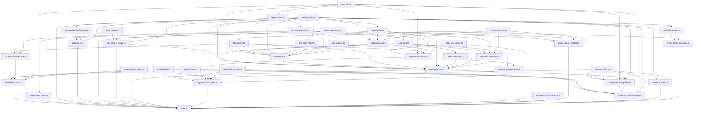

# Task Manager Plugin

Automates task lifecycle management in Obsidian: state transitions, completion metadata stamping, recurring task creation, file routing by status, editor autocomplete for date fields, a right-sidebar date dashboard, quick capture straight into today's daily note, a live, searchable "Organize Captured Tasks into Projects" tab, a live, searchable Projects Summary tab, and a generated Obsidian Bases "Tasks Summary" file for reviewing Projects/Waiting/Someday-Maybe/Scheduled.

> For developer/agent architecture reference, see [`CLAUDE.md`](CLAUDE.md).

## Setup

1. Enable the **Task Manager** plugin in Obsidian settings.
2. Open **Plugin Settings** and configure:

   | Setting | Description | Default |
   |---|---|---|
   | Projects Folder | Root folder scanned for active project notes | — |
   | Completed Projects Folder | Destination for completed projects | — |
   | Waiting Projects Folder | Destination for waiting projects | — |
   | Someday-Maybe Projects Folder | Destination for someday-maybe projects | — |
   | Scheduled Projects Folder | Destination for scheduled (tickler) projects — deferred via the due date on the first task, hidden from the dashboard/Tasks Summary Base until then | — |
   | Archived Projects Folder | Destination for archived Someday-Maybe projects — a one-way exit from the review rotation, excluded from the dashboard, the Tasks Summary Base, and Projects Summary entirely | — |
   | Completed Status Field | Frontmatter field name written on completion | `status` |
   | Dashboard Filename Hide Keywords | Comma-separated keywords stripped from display names in the dashboard | — |
   | Someday-Maybe Review Cadence (days) | Days a Someday-Maybe project can go unreviewed before the Projects Summary flags it | `30` |
   | Waiting Staleness Threshold (days) | Days a project can stay in Waiting before the Projects Summary flags it as stale | `7` |
   | Bases File Path | Vault-relative path for the generated Obsidian Bases file (**Create Tasks Summary** command) | `Tasks/Tasks Summary.base` |

3. **Quick Capture** and **Organize Captured Tasks into Projects** (below) read the daily note folder/date format straight from Obsidian's own **Daily Notes** core plugin (Settings → Core plugins) — there's no separate Task Manager setting for it. Enable and configure that core plugin first.

## Commands

### Reset Tasks
In the active file:
- Marks all tasks open (`[ ]`).
- Removes `[due:: ...]`, `[completion-date:: ...]`, `[completion-time:: ...]`, and `[created:: ...]` from task lines.
- Then re-runs the same task reconciliation and routing flow for the file.

### Organize Captured Tasks into Projects
Opens an **Organize Captured Tasks into Projects** tab (a full main-panel tab, not a generated note or sidebar panel — same placement pattern as Projects Summary), reusing an already-open tab instead of duplicating it. It shows *every* open task found in your daily notes within today ± 1 year — not just ones added via Quick Capture, any open checkbox written directly in a journal entry counts too — each with a selection checkbox, so you can bundle related captures into a project in one pass. Reviewing your actual Projects/Waiting/Someday-Maybe/Scheduled folders lives in the generated **Tasks Summary** Bases file instead (see [Create Tasks Summary](#create-tasks-summary)) — this tab exists specifically for the one thing Bases can't do: writing new files from raw captured task lines.

While the tab is open, it auto-refreshes (debounced) whenever a daily note within the scan window is modified, renamed, or deleted elsewhere — including Due Date Modal submits. There's no separate "regenerate" step.

The table has columns Date (links back to the source daily note) | Task | Priority | Recurrence | Due (`MM-DD`), sorted most-recent-day-first. The section is collapsible — click its heading to collapse or expand it; the heading shows the total row count (e.g. "Organize Captured Tasks into Projects (12)"). A priority filter and a search box above the table narrow it the same way as the date dashboard and Projects Summary (both per-session UI state, not saved to settings).

- **Create project from selected** opens the **Add New Project** modal prefilled with the checked tasks' text; submitting creates the project and removes the originals from their source daily notes.
- **Move to existing project** opens a fuzzy file picker over your Projects/Waiting/Someday-Maybe/Scheduled folders; picking a file appends the checked tasks to it (above `## Completed Tasks` if present, else at the end of the file) and removes the originals from their source daily notes.

Both buttons are disabled until at least one task is checked. Selected tasks can come from different daily notes at once — each source file is updated correctly. If a checked task was edited or removed elsewhere between checking it and clicking the button, that one line is safely skipped (reported via a notice) rather than corrupting an unrelated line.

### Add New Project
Opens a modal to create a new project file. The form collects:

- **Name** — used for the filename and note heading
- **Folder** — target vault path, with folder suggestions as you type
- **Priority** — written to file frontmatter as `priority`
- **Status** — one of `todo`, `waiting`, `someday-maybe`, or `scheduled`, written to the configured status frontmatter field
- **Scheduled Date** — shown only when Status is `scheduled`; a required `YYYY-MM-DD` date, written as the due date on the first starter task below it (see [Scheduled Projects](#scheduled-projects)) — requires at least one starter task
- **Tasks** — optional multiline text area; each non-empty line becomes an open task

The command creates the project note, creates missing parent folders, and opens the new file.

### Open Random Someday-Maybe Project
Opens a random project file from the configured **Someday-Maybe Projects Folder** in a new tab, stamping `reviewed: YYYY-MM-DD` on it first (see [Open Projects Summary](#open-projects-summary)) — a casual glance still counts as a review. Also available as a shuffle-icon ribbon button in the left sidebar. If the folder setting is empty, or the folder contains no project files, a notice explains why nothing opened instead of failing silently.

### Quick Capture Task
Opens a single-line capture modal from anywhere in the vault — no need to open today's daily note first. Also available as a list-plus-icon ribbon button in the left sidebar. Press Enter or click **Capture** to insert the text as a new open task (`- [ ] ...`) under a `## Tasks` heading in **today's daily note**, prepended above any earlier captures for the day. The `## Tasks` heading is created (right after the note's title heading, if any) the first time you capture on a given day; the daily note itself is created too if it doesn't exist yet, using Obsidian's own **Daily Notes** core plugin folder/format settings.

End the input with `due:` followed by a date to attach a due date at capture time, e.g. `Call the dentist due:tomorrow` or `Renew passport due:2026-08-01` — accepts the same values as the `due::` editor autocomplete (ISO dates, `today`/`tomorrow`, weekday names). The recognized trailing token is stripped from the task text and written as a `[due:: ...]` inline field; an unrecognized trailing `due:` token is left in place as part of the task text instead of being dropped. If the core Daily Notes plugin is disabled or unconfigured, a notice explains why the modal didn't open.

### Open Projects Summary
Opens a **Projects Summary** tab (a full main-panel tab, not a generated note or sidebar panel) with four sections. Every section's **Project** column links to the file styled by the file's frontmatter priority — **bold** for priority 1, *italic* for priority 2, default for priority 3, same convention as the date dashboard — and each table also has a plain numeric **Priority** column:

- **Active Projects** — every project in the configured **Projects Folder**, with Priority, Days Since Review, and Last Reviewed columns, sorted least-recently-reviewed first, ties broken by priority ascending — no filtering or threshold, the full list is always shown. Never-reviewed projects sort first. Each row has a **Mark Reviewed** button that stamps today's date; the project then sorts toward the bottom of the list on the next refresh, since the list is always ordered stalest-first.
- **Waiting** — every project in the configured **Waiting Projects Folder**, with Priority, Days Waiting, and Waiting Since columns, sorted most-stale-first, ties broken by priority ascending. Projects with no `waiting-since` stamp yet (e.g. from before this feature existed) sort first; run **Stamp Waiting-Since For Existing Waiting Projects** (below) to backfill them. A project is marked **Newly stale** when it crosses the **Waiting Staleness Threshold** setting within the current week (Monday through Sunday).
- **Someday-Maybe** — every project in the configured **Someday-Maybe Projects Folder**, with Priority, Days Since Review, and Last Reviewed columns, sorted most-overdue-first, ties broken by priority ascending. Never-reviewed projects sort first. A project is marked **Needs Review** when it's never been reviewed or has gone longer than the **Someday-Maybe Review Cadence** setting. Each row has three buttons: **Mark Reviewed** stamps today's date and refreshes the table in place; **Promote to Active** flips the project to `todo` and routes it to the Projects Folder; **Archive** flips it to `archived` and routes it to the configured **Archived Projects Folder** — a one-way exit from the review rotation for ideas you've decided not to pursue, distinct from `completed` (which means "done," not "abandoned"). This section starts **collapsed** by default, since it's backlog material rather than the daily-glance content of the other three sections — click its heading to expand it.
- **Scheduled** — every project in the configured **Scheduled Projects Folder**, with Priority, Scheduled Date, and Days Until columns (the date is read from the due date on the file's first task), sorted soonest-to-arrive first. Projects whose first task has no due date sort last (there's no date to act on, unlike the other sections' never-stamped-sorts-first convention). Each row has a **Promote Now** button to pull a project out of Scheduled ahead of its date. See [Scheduled Projects](#scheduled-projects).

Every section is collapsible — click its heading to collapse or expand it; the heading shows the section's total row count. Collapse state is per-session and survives auto-refreshes.

`waiting-since` is stamped automatically the moment a project's status changes to `waiting`, and cleared when it leaves `waiting` — no manual action needed for projects routed after this feature shipped. `reviewed` (shared by Active Projects and Someday-Maybe) is stamped by clicking **Mark Reviewed** in this view, or — for Someday-Maybe only — by opening a project via **Open Random Someday-Maybe Project**, which doubles as a casual review at no extra effort.

While a Projects Summary tab is open, it auto-refreshes (debounced) whenever a file in the Projects, Waiting, Someday-Maybe, or Scheduled folders is modified, renamed, or deleted elsewhere — you don't need to close and reopen the tab, or re-run the command, to see changes made from another note.

**Priority filter**: a dropdown above the sections narrows every table to priority 1 only, or priority 1–2. Selection is per-session UI state, not saved to settings.

**Search**: a search box above the sections narrows every row to files whose name or path matches the typed text (case-insensitive).

### Stamp Waiting-Since For Existing Waiting Projects
A one-time backfill command: stamps today's date on any file in the Waiting Projects Folder that doesn't already have a `waiting-since` field (from before the Projects Summary feature existed). Safe to re-run — files that already have the field are skipped.

### Stamp Derived Fields For All Projects
Resyncs [derived frontmatter fields](#derived-frontmatter-fields) (`next-due`, `next-action`, `open-tasks`) on every tracked project file. Unlike the waiting-since backfill, this isn't a one-time migration — it's safe to re-run any time, e.g. after bulk-editing files outside Obsidian. Reports how many files were stamped and how many were already current.

### Create Tasks Summary
Generates an [Obsidian Bases](https://help.obsidian.md/bases) file at the configured **Bases File Path** (default `Tasks/Tasks Summary.base`), with five table views wired to your configured folders: **Active projects**, **Next actions** (any file with a `next-due`), **Waiting**, **Someday-Maybe review**, and **Scheduled**. Every view's first column is Folder (the file's parent path), matching the Folder-first convention used by the date dashboard and Projects Summary. Requires the **Bases** core plugin (Settings → Core plugins) — if it's disabled, the command still generates the file but shows a Notice reminding you to enable it. This is the review surface for Projects/Waiting/Someday-Maybe/Scheduled — the Organize Captured Tasks into Projects tab covers only captured tasks in daily notes (see [Organize Captured Tasks into Projects](#organize-captured-tasks-into-projects)).

Re-running the command **overwrites the file immediately, with no confirmation prompt** — it's meant to be a cheap, frequent way to pick up folder-setting changes or a Bases File Path rename, not a one-time scaffold. Any manual view customizations made from Bases' own UI are discarded on re-run. The generated views sort and filter using this plugin's own frontmatter fields (`status`, `priority`, `waiting-since`, `reviewed`) plus the [derived fields](#derived-frontmatter-fields) above — so `next-due`/`next-action`/`open-tasks` need to already be flowing (they are, automatically, once you're on this version) for the generated views to show meaningful data. The four hyphenated fields (`next-due`, `next-action`, `open-tasks`, `waiting-since`) are exposed as named formulas (e.g. `formula.nextDue`) with a friendly column label, rather than referenced directly — a plain `note["next-due"]`-style reference renders as a blank column in Bases, even with a display-name override, so this plugin never generates one.

## Automatic Behavior (live editing)

The plugin reacts to checkbox changes as you edit, but only for markdown files inside the configured Projects / Completed / Waiting / Someday-Maybe / Scheduled / Archived folders. Daily notes and other random notes elsewhere in the vault are ignored by the live task-processing pipeline — captured tasks in daily notes get no completion stamping, routing, or Due Date Modal until they're bundled into a project via [Organize Captured Tasks into Projects](#organize-captured-tasks-into-projects).

### Task Completed (`[ ]` → `[x]`)
- Appends `[completion-date:: YYYY-MM-DD]` and `[completion-time:: HH:MM:SS]` to the completed task line.
- Moves the completed task line into the `## Completed Tasks` section of the same file (creates the section at the end if absent), along with any attached note lines (see [Task Notes](#task-notes)).
- The first remaining open task becomes the current actionable task implicitly. If none remain, the file status becomes `completed` and `completion-date` / `completion-time` are also stamped into the **file frontmatter**.
- Prompts with a **Due Date Modal** to assign a due date and set the file priority for the newly exposed actionable task (see below).

### Task Uncompleted (`[x]` → `[ ]`)
- If the reopened task is now actionable (the file's first open task), it becomes the current actionable task implicitly. Status resets to `todo`.

The plugin always uses the first incomplete task in the file as the current actionable task — exactly one actionable task per file.

### Recurring Tasks
If a completed task has `[repeat:: X]` or `[repeats:: X]`, a new open copy is inserted above the completed task with a computed due date. The grammar is case-insensitive and covers most of Todoist's recurring-date syntax (excluding time-of-day/hourly rules and the `starting`/`for N` bound forms):

| Form | Example | New due date |
|---|---|---|
| Interval | `daily`, `2 weeks`, `other month`, `quarterly`, `2 quarters` | +N units (`other X` = 2×; `quarter` = 3 months) |
| Workday interval | `weekday` / `workday`, `3 workdays` | Nth workday (Mon–Fri) ahead |
| Weekday set | `Monday`, `mon, wed, fri` | Next day matching one in the set |
| Month-day set | `5th`, `2, 15, 27` | Next such day-of-month (clamped to month length) |
| Last day / last workday | `last day`, `last workday` | End of month (last workday walks back from month-end to Friday if needed) |
| Nth weekday of month | `1st wed`, `last friday` | That weekday's Nth (or last) occurrence, monthly |
| Yearly nth weekday | `3rd thu jul`, `3rd thursday of july` | Same, restricted to one named month, yearly |
| Yearly date | `jan 27`, `27 jan`, `january 27th` | That date each year (Feb 29 clamps to Feb 28 in non-leap years) |

Accepted aliases are normalized automatically:
- Day: `day`, `days`, `daily`
- Week: `week`, `weeks`, `weekly`
- Month: `month`, `months`, `monthly`
- Quarter: `quarter`, `quarters`, `quarterly` (= 3 months)
- Year: `year`, `years`, `yearly`, `annual`, `annually`
- Weekdays: full or short names like `monday` / `mon`
- Months: full or short names like `january` / `jan`
- Month days: ordinal forms `1st` through `31st` (plain digits are also accepted inside a comma-separated set, e.g. `2, 15, 27`)

**Prefixes — anchoring the next date:** a plain rule (no prefix, or `every`/`ev`) anchors the next date to the task's **previous `[due:: ...]` date** — completing an overdue task doesn't shift its future schedule, and completing early doesn't shorten it. A `every!`/`ev!` prefix (or `after N <unit>`, a shorthand for the same thing) anchors to the **completion date** instead — the classic "N days after I actually finish it" behavior. In both modes, the computed date is always strictly after today, so a long-overdue recurring task never spawns an already-overdue clone; for interval rules this means catch-up is computed directly from the anchor date, not chained step-by-step (e.g. a monthly task due Jan 31, completed in mid-April, becomes due Apr 30 — not drifted down to Apr 28 by re-clamping three times).

**Suffix — ending the recurrence:** append `until YYYY-MM-DD` or `ending YYYY-MM-DD` (ISO dates only) to stop recurring after that date, inclusive. Once the computed next date would fall after the bound, completion stamps normally but no new copy is created, and a Notice explains why.

Examples: `every! 3 days`, `ev fri`, `mon, wed, fri until 2026-12-31`, `1st wed`, `last workday`, `jan 27`.

Weekday, month-day, and calendar-date repeats always resolve to the **next future occurrence** relative to the anchor. For example, `Monday` completed on a Monday becomes next Monday, and `5th` completed on the 5th becomes next month's 5th.

If a `[repeat:: ...]` field can't be parsed at all, completion still proceeds normally (stamping, moving to Completed Tasks) but no recurring copy is created, and a Notice names the unrecognized value. More generally, whenever a task with an unparseable (or absent) `[repeat:: ...]` field newly becomes actionable, the Due Date Modal's Repeat field is prefilled with that raw value, so a broken repeat rule is easy to spot and fix in place.

Recurring tasks skip the Due Date Modal on the new copy.

### Status Routing
When a file's status field changes to a routable value (`todo`, `completed`, `waiting`, `someday-maybe`, `scheduled`, or `archived`), the file is automatically moved to the matching destination folder.
When the plugin edits a project file's frontmatter metadata during this flow, it also writes `priority: 3` if the file does not already have a priority field.
When a file's status changes to `waiting`, `waiting-since: YYYY-MM-DD` is also stamped into its frontmatter (today's date); when it changes away from `waiting`, that field is removed. This powers the Projects Summary's staleness tracking — see [Open Projects Summary](#open-projects-summary).
That same status change also pokes any open Organize Captured Tasks into Projects tab to refresh — a cheap no-op re-render since the changed file is a project, not a daily note.

## Scheduled Projects

The `scheduled` status is for projects that don't need review or action right now but should reappear on a specific future date — a GTD-style "tickler." A scheduled project:

- Lives in the configured **Scheduled Projects Folder**, routed there like any other status.
- Has **no separate scheduling field** — its date comes from the `[due:: YYYY-MM-DD]` on its **first task** (whichever task is currently first/actionable in the file). There's nothing extra to keep in sync: set or change the due date on that task the same way you would for any other task, and the project's schedule follows.
- Is **excluded** from the date dashboard's Due/Completed sections and from the Tasks Summary Bases file's views, so it never demands attention before its date. It still appears in the **Projects Summary**'s Scheduled section for a lightweight glance (see [Open Projects Summary](#open-projects-summary)), and its checkboxes still reconcile normally if you edit it directly.
- **Auto-promotes to `todo`** once today is within **7 days** of that first task's due date — not on the date itself, so it surfaces in your Projects folder with a week of lead time instead of risking getting missed — routing the file to the Projects Folder like any other status change. The due date on the task is left untouched; it just becomes an ordinary task due date once the project is `todo`. This is checked in two places: once at plugin load (so items don't sit un-promoted just because Obsidian was closed when the lead window opened), and again on any edit to the file. You can also jump the queue early with **Promote Now** in the Projects Summary's Scheduled section. A project with no due date on its first task is never auto-promoted — it just sits in Scheduled like a Someday-Maybe item until you add one or promote it manually.

**Add New Project** offers a convenience **Scheduled Date** field when Status is `scheduled` (required, at least one starter task required too) — it's written as the `[due:: YYYY-MM-DD]` on the first starter task, not to frontmatter.

## Archived Projects

The `archived` status is a one-way exit from the review rotation for Someday-Maybe ideas you've decided not to pursue — distinct from `completed`, which means "done," not "abandoned." An archived project:

- Lives in the configured **Archived Projects Folder**, routed there like any other status.
- Is **excluded** from the date dashboard, the Tasks Summary Bases file's views, and every section of the Projects Summary — it simply disappears from the review rotation rather than continuing to demand a "needs review" decision every cycle.
- Its checkboxes still reconcile normally if you edit it directly (completion stamping, recurring tasks, etc. all still work) — it's just not surfaced anywhere until you move it out of that status.

There is no command to create a project directly as `archived` — reach it via the Projects Summary's Someday-Maybe **Archive** button (see [Open Projects Summary](#open-projects-summary)), or by hand-editing the status frontmatter field.

## Due Date Modal

When a task newly becomes actionable after completion or uncompletion (and that task is not recurring), a modal appears offering:

- A preview of the task text.
- A **project priority** dropdown (1–3, default 3; 1 is highest).
- Suggested dates from today through +30 days with Today / Tomorrow / weekday labels — clicking one immediately applies it.
- A text input for a custom `YYYY-MM-DD` date or natural-language terms (`today`, `tomorrow`, weekday names); press Enter to submit. If the task already has a due date, it is prefilled here.
- A **Repeat** text field for rules like `daily`, `2 weeks`, `mon, wed, fri`, `1st wed`, `last workday`, or `jan 27` (see [Recurring Tasks](#recurring-tasks) for the full grammar) — prefilled with the task's existing raw repeat value if it has one (most often seen when that value failed to parse and needs fixing).
- A **Skip** button to dismiss without adding a due date.

On submit, `[due:: YYYY-MM-DD]` is written to the task line, an optional `[repeat:: X]` is added when provided, and `priority: N` is written to the file frontmatter.
That update also pokes any open Organize Captured Tasks into Projects tab to refresh.

## Inline Field Format

Tasks use Dataview-style double-colon inline fields on the same line as the checkbox:

| Field | Description |
|---|---|
| `[due:: YYYY-MM-DD]` | Due date |
| `[completion-date:: YYYY-MM-DD]` | Stamped on task completion |
| `[completion-time:: HH:MM:SS]` | Stamped on task completion |
| `[repeat:: X]` / `[repeats:: X]` | Recurring rule — see [Recurring Tasks](#recurring-tasks) for the full grammar (intervals, weekday/month-day sets, nth-weekday-of-month, yearly dates, `every!`/`until` modifiers) |
| `[created:: YYYY-MM-DD]` | Creation date (editor suggest only) |

Project priority is stored in file frontmatter as `priority: N`, where `1` is highest and missing/invalid values default to `3`.

## Derived Frontmatter Fields

Every tracked project file gets three auto-managed frontmatter fields, recomputed on every relevant edit and mirrored from its task lines so file-level tools — [Bases](https://help.obsidian.md/bases), Dataview, vault search — can see task-level data that inline `[due:: ...]` fields alone don't expose:

| Field | Value | When there's no open task |
|---|---|---|
| `next-due` | The first open task's `[due:: ...]` date | Field removed |
| `next-action` | The first open task's text, with inline fields and tags stripped | Field removed |
| `open-tasks` | Count of open task lines in the file | `0` |

The task line is always the source of truth — these fields are a read-only mirror, restamped automatically after every completion, uncompletion, task edit, status change, and file creation. Writes only happen when a value actually changed, so editing an unrelated part of a file doesn't touch these fields. Use **Stamp Derived Fields For All Projects** (above) to force a full resync.

## Task Notes

Plain indented lines written directly under a task (no checkbox) are treated as that task's note/description block — free text for context or detail that isn't independently actionable. A note block is any run of lines immediately below the task line that's indented deeper than the task itself and isn't a checkbox line or a heading; blank lines are allowed within the block for multi-paragraph notes.

```markdown
- [ ] Call the plumber [due:: 2026-07-20]
  Ask about the quote from last time — mentioned $200 for the fitting.
  Number is on the fridge whiteboard.
```

Note blocks are not tasks: they never appear as rows in the date dashboard, Organize Captured Tasks into Projects, or Projects Summary, and they don't affect first-incomplete-task selection. When the task above them is completed, the note block moves into `## Completed Tasks` together with the completed line, directly beneath it — unless the task recurs (`[repeat:: ...]`), in which case the note block moves onto the newly inserted open clone instead, so multi-line context (a checklist, reference info) carries forward into the next occurrence rather than getting buried in completed-task history.

An indented **checkbox** line (`  - [ ]`) under a task is not a note — it's parsed and treated as its own independent task line, same as any top-level task (this plugin has no separate sub-task/child-task concept).

## Editor Autocomplete

- Typing `due::` opens a suggestion list from today through +30 days, labeled Today / Tomorrow / weekday names. Matches on ISO date or natural-language label. Inserts ` YYYY-MM-DD`.
- Typing `created::` suggests today's date. Inserts ` YYYY-MM-DD`.

## Date Dashboard

When the active note is named `YYYY-MM-DD`, a live dashboard opens in the right sidebar with two sections plus a link:

**Due** — open tasks with `[due:: YYYY-MM-DD]` where the due date is on or before the note date. Scanned from the configured Projects / Completed / Waiting / Someday-Maybe folders — deliberately **not** the Scheduled or Archived folders; Scheduled projects stay hidden until their first task's due date arrives (see [Scheduled Projects](#scheduled-projects)) and Archived projects never surface at all (see [Archived Projects](#archived-projects)). Rendered as a single table with columns Folder | Project | Task | Priority | Recurrence | Due (`MM-DD`) and sorted by file priority, then due date.

An **Organize Captured Tasks into Projects** link — jumps straight to the [Organize Captured Tasks into Projects tab](#organize-captured-tasks-into-projects) for reviewing and bundling captured tasks across all daily notes, including today's.

**Completed** — tasks with `[completion-date:: YYYY-MM-DD]` matching the note date from the same folders as Due above (Scheduled and Archived excluded). Columns: Folder | Project | Task | Priority | Recurrence. Sorted by file priority, then file path.

Display notes:
- Due and Completed tables are grouped by parent folder and filename using `rowspan`, preserving priority-first row ordering.
- Task text strips all inline fields and hashtag tags. The **Project** cell's link, not the task text, carries the priority styling: **bold** for priority 1, *italic* for priority 2, default for priority 3, using the file's frontmatter priority.
- **Dashboard Filename Hide Keywords**: each keyword is removed case-insensitively from folder and filename display names.
- On non-date notes, the dashboard defaults to today's date.
- **Priority filter**: a dropdown above the sections narrows Due and Completed to priority 1 only, or priority 1–2. Selection is per-session UI state, not saved to settings.
- **Search**: a search box above the sections narrows Due and Completed to tasks matching the typed text (task text — case-insensitive).

## Code Organization

| File | Purpose |
|---|---|
| `main.ts` | Plugin entry point; wires all services and event listeners |
| `main.js` | Bundled runtime output loaded by Obsidian (`npm run build` regenerates this) |
| `src/tasks/task-processor.ts` | Central orchestrator: vault modify/create events, commands, routing |
| `src/tasks/reconciler.ts` | Task transition logic: completion, uncompletion, deletion, recurring |
| `src/tasks/file-priority.ts` | Pure helpers for reading file-frontmatter priority |
| `src/tasks/task-line-metadata.ts` | Pure shared task-line parsing and display-text helpers |
| `src/tasks/repeat-rules.ts` | Pure recurring-rule parser (Todoist-level grammar: intervals, weekday/month-day sets, nth-weekday-of-month, yearly dates, `every`/`every!`/`until` modifiers), alias normalizer, and next-occurrence calculator — the sole owner of the `[repeat::]`/`[repeats::]` field extraction regex |
| `src/tasks/task-utils.ts` | Pure parsing/diffing utilities (no side effects) |
| `src/tasks/next-actions.ts` | Pure actionable-task-line finder: the file's first open task line |
| `src/tasks/task-state-store.ts` | In-memory per-file task/status snapshot cache and pending-write guards |
| `src/tasks/due-date-modal.ts` | Modal for collecting due date and file priority for a newly actionable task |
| `src/tasks/quick-capture-modal.ts` | Single-input modal for capturing a task into today's daily note, with `due:` shorthand parsing |
| `src/tasks/frontmatter-utils.ts` | Shared single-field frontmatter parser over a content string |
| `src/tasks/derived-frontmatter.ts` | Pure helpers computing/comparing/applying the `next-due`/`next-action`/`open-tasks` mirrored fields — see [Derived Frontmatter Fields](#derived-frontmatter-fields) |
| `src/projects/add-project-modal.ts` | Modal and helpers for creating a new project note from command input or a prefilled captured-tasks-to-project bundle |
| `src/projects/random-project.ts` | Lists Someday-Maybe project files and picks one at random |
| `src/tables/grouped-task-table.ts` | Pure grouped task-table model and shared display formatting for dashboard/summary tables |
| `src/journal/daily-note-config.ts` | Reads Obsidian's core Daily Notes plugin folder/date-format config and resolves today's daily note path; owns the shared `## Tasks` heading constant |
| `src/journal/captured-tasks-data.ts` | Pure(ish) data layer: scans daily notes within ± 1 year for every open task line for the Organize Captured Tasks into Projects tab (no writes) |
| `src/journal/captured-tasks-view.ts` | On-demand main-panel ItemView controller/renderer for the Organize Captured Tasks into Projects tab: priority filter, collapsible section, selection checkboxes and captured-tasks-to-project actions, auto-refresh on relevant vault changes |
| `src/journal/captured-tasks-actions.ts` | Removes selected lines from their source daily notes (grouped per file) and appends task lines into an existing project's open-task area — the captured-tasks-to-project write path |
| `src/summary/summary-file-io.ts` | Shared pure folder-scan helper used by Projects Summary, the Organize Captured Tasks into Projects tab, and the random-project picker |
| `src/routing/status-routing.ts` | Status extraction, validation, routable-status constants (`todo`/`completed`/`waiting`/`someday-maybe`/`scheduled`/`archived`) |
| `src/routing/task-routing.ts` | File movement: destination resolution, folder creation, merge handling |
| `src/dashboard/date-dashboard.ts` | Right-sidebar ItemView controller and renderer |
| `src/dashboard/dashboard-task-data.ts` | Task parsing/filtering/sorting for dashboard display |
| `src/date/date-utils.ts` | Pure shared date formatting, ISO date helpers, and end-of-week/threshold-crossing helpers used by the Projects Summary |
| `src/editor/due-date-suggest.ts` | EditorSuggest providers for `due::` and `created::` inline fields |
| `src/date/date-suggestions.ts` | Canonical date suggestion list (ISO dates + human labels) |
| `src/settings/settings-utils.ts` | `TaskManagerSettings` type, `DEFAULT_SETTINGS`, `normalizeSettings()` |
| `src/settings/settings-ui.ts` | PluginSettingTab renderer |
| `src/settings/settings-field-definitions.ts` | Declarative metadata for settings controls |
| `src/settings/folder-picker.ts` | FuzzySuggestModal wrappers for vault folder/file pickers |
| `src/commands/register-task-commands.ts` | Registers Reset Tasks, Organize Captured Tasks into Projects, Add New Project, Open Random Someday-Maybe Project, Quick Capture Task, Open Projects Summary, Stamp Waiting-Since, Stamp Derived Fields, and Create Tasks Summary commands |
| `src/bases/base-file-content.ts` | Pure YAML string builder for the generated `.base` file — five table views over the configured folders |
| `src/bases/create-tasks-summary.ts` | I/O for the Create Tasks Summary command: Bases-core-plugin detection, vault write (overwrites an existing file without confirmation) |
| `src/review/projects-summary-view.ts` | On-demand main-panel ItemView controller/renderer for the Projects Summary tab: priority filter, collapsible sections (Someday-Maybe collapsed by default), Someday-Maybe row actions (Mark Reviewed/Promote to Active/Archive), auto-refresh on relevant vault changes |
| `src/review/projects-summary-data.ts` | Collects Active Projects/Waiting/Someday-Maybe staleness rows, stamps the `reviewed` field, and sets a project's status directly (Promote to Active/Archive) |
| `src/ui/search-filter.ts` | Shared search-box UI, used by the date dashboard, Projects Summary, and Organize Captured Tasks into Projects views |
| `src/ui/priority-filter.ts` | Shared priority-filter dropdown UI and row filter, used by the date dashboard, Organize Captured Tasks into Projects, and Projects Summary views |
| `src/ui/collapsible-section.ts` | Shared `<details>`/`<summary>` collapsible-section UI, used by the Organize Captured Tasks into Projects and Projects Summary views |
| `manifest.json` | Obsidian plugin metadata |

## Dependency Graph


```mermaid
graph TD
   M[main.ts]

   D[date-dashboard.ts]
   DTD[dashboard-task-data.ts]
   E[due-date-suggest.ts]
   DU[date-utils.ts]
   DS[date-suggestions.ts]

   SUI[settings-ui.ts]
   SU[settings-utils.ts]
   SFD[settings-field-definitions.ts]
   FP[folder-picker.ts]

   RS[status-routing.ts]
   RT[task-routing.ts]
   AP[add-project-modal.ts]
   RP[random-project.ts]
   GT[grouped-task-table.ts]

   TP[task-processor.ts]
   RC[reconciler.ts]
   PRI[file-priority.ts]
   TLM[task-line-metadata.ts]
   FMU[frontmatter-utils.ts]
   DFM[derived-frontmatter.ts]
   RR[repeat-rules.ts]
   DDM[due-date-modal.ts]
   QC[quick-capture-modal.ts]
   TS[task-state-store.ts]
   TU[task-utils.ts]
   NA[next-actions.ts]
   DNC[daily-note-config.ts]
   CTD[captured-tasks-data.ts]
   CTV[captured-tasks-view.ts]
   CTA[captured-tasks-actions.ts]
   SFIO[summary-file-io.ts]
   CMD[register-task-commands.ts]
   WRV[projects-summary-view.ts]
   WRD[projects-summary-data.ts]
   SF[search-filter.ts]
   PF[priority-filter.ts]
   CSEC[collapsible-section.ts]
   BFC[base-file-content.ts]
   CTS[create-tasks-summary.ts]

    D --> M
    E --> M
    SU --> M
    SUI --> M
    RT --> M
    AP --> M
    TP --> M
    CTV --> M
    DNC --> M
    CMD --> M
    QC --> M
    DS --> QC
    WRV --> M

    SF --> D
    SF --> WRV
    SF --> CTV
    PF --> D
    PF --> WRV
    PF --> CTV
    CSEC --> WRV
    CSEC --> CTV

    WRD --> WRV
    DU --> WRV
    SU --> WRV
    SFIO --> WRV
    SFIO --> WRD
    FMU --> WRD
    DU --> WRD
    TP --> WRD
    SU --> WRD

    CTD --> CTV
    GT --> CTV
    SU --> CTV
    SFIO --> CTV
    AP --> CTV
    CTA --> CTV
    TU --> CTA
    DNC --> CTD
    DU --> CTD
    PRI --> CTD
    TLM --> CTD

     DTD --> D
     DU --> D
     GT --> D
     PRI --> DTD
     TLM --> DTD

     DS --> E

   SFD --> SUI
   SU --> SFD
   FP --> SUI
   SU --> SUI

   SU --> RS
   RT --> RS
   SU --> RT

    FP --> AP
    RT --> AP
    SU --> AP

    SU --> RP
    RP --> M
    SFIO --> RP

     SU --> TP
     TU --> TP
    RC --> TP
   PRI --> TP
   RT --> TP
   RS --> TP
   TS --> TP
   FMU --> TP
   DFM --> TP
   TU --> DFM
   TLM --> DFM
   FMU --> DFM

   BFC --> CTS
   SU --> BFC
   RT --> CTS
   CTS --> M

    TU --> RC
    DU --> RC
    PRI --> RC
    RR --> RC
    SU --> RC
    RS --> RC
    DDM --> RC
    TLM --> RC
    NA --> RC
    DS --> DDM
    DS --> QC
    TLM --> TU
    TLM --> NA
    DU --> RR
    RR --> TLM

    TU --> TS
    CTD --> CTA

    FMU --> RS
    FMU --> PRI
```
